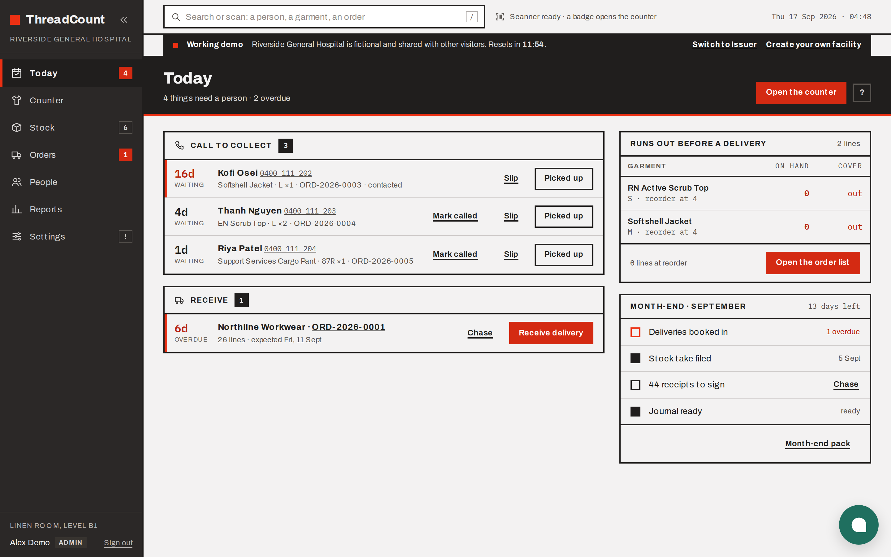
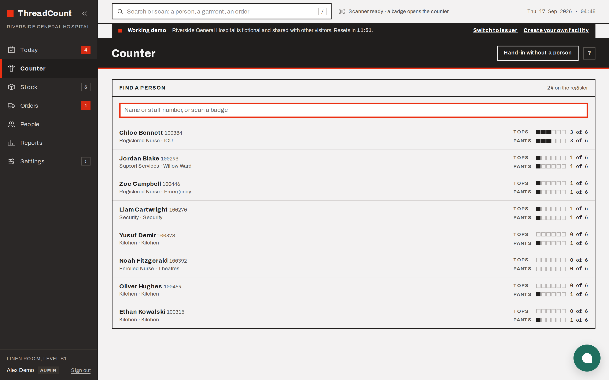
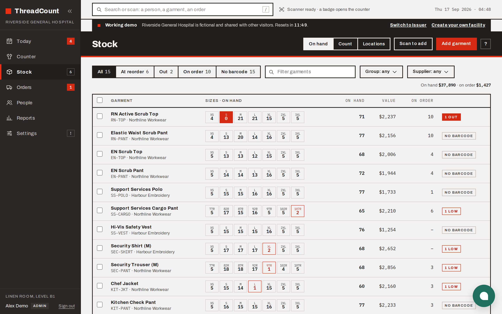
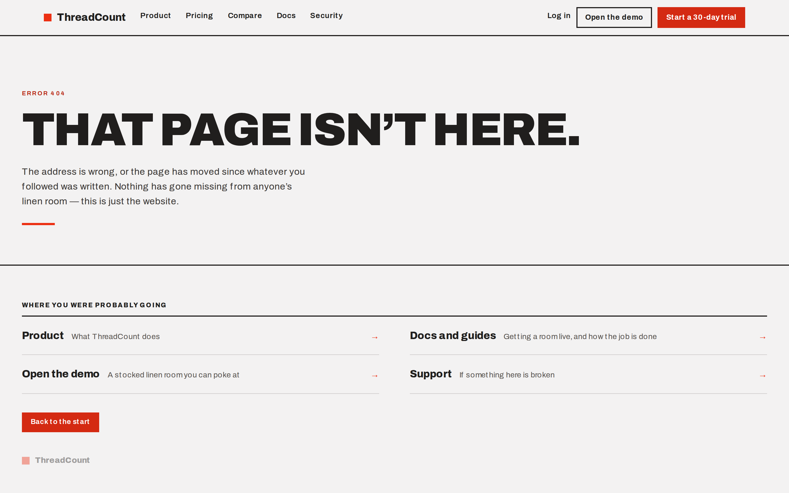
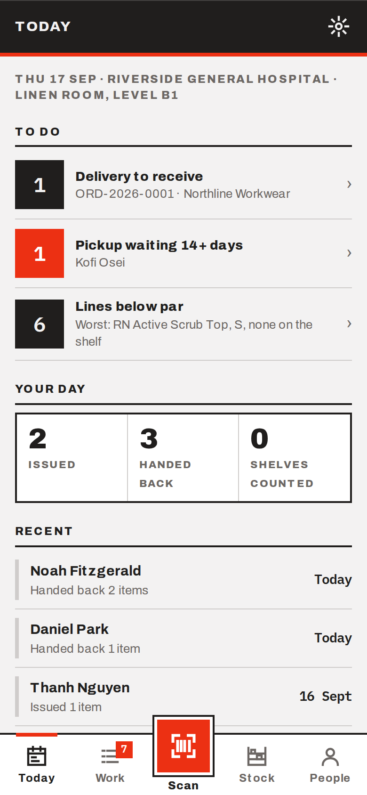

<p align="center"></p>

# ThreadCount

Uniform stock management for hospital, aged-care and clinic linen rooms. It tracks what is on the
shelf, who was issued what, what each ward was charged, and the supplier orders and stocktakes in
between.

It is free software, published under the AGPL, and you run it on your own server. There is no
hosted plan, nothing to buy and nobody to sign a contract with. Install takes about five minutes
on a server that already has Docker; the steps are below, and the longer guide is
[docs/self-hosting.md](docs/self-hosting.md).

**[Open the live demo](https://threadcount.tech/demo)** — a shared facility with invented data, no
sign-up, rebuilt every twenty minutes. Issue a garment, run a count, look at the reports.

## What you get

- **The coordinator app** at `/app`: catalogue, stock, issuing against entitlement, orders and
  receiving, stocktakes, nine reports, CSV import and export, full JSON backup and restore.
- **The phone counter** at `/m`: camera barcode scanning, issue at the counter, count by shelf,
  pickups and delivery rounds.
- **The staff app** at `/my`: staff see their own kit, request garments, managers approve.
- The two Android apps on Google Play can be pointed at your server (see below).

Every feature a linen room uses is here, with no locked tier and no ceiling on staff, users or
devices. The public website itself is not part of the published code, and neither is single
sign-on.

## What it looks like

The demo facility, on a laptop and on a phone. Nothing here is a real room, a real person or a real
supplier — the demo's data is invented and rebuilt every twenty minutes.

| The coordinator app | The counter |
|---|---|
| [](docs/screenshots/coordinator-dashboard.png) | [](docs/screenshots/counter-desktop.png) |
| **Stock** | **Reports** |
| [](docs/screenshots/stock.png) | [](docs/screenshots/reports.png) |

<p align="center">
  
  <br><em>The phone counter — the camera reads badges, garments and shelf labels.</em>
</p>

## Requirements

- A Linux server with Docker and Docker Compose (2 CPU, 2 GB RAM is plenty to start).
- A hostname pointing at it, with HTTPS in front (Caddy, nginx or Traefik). The app sets secure
  cookies, so sign-in will not work over plain HTTP from another machine.

## Install

```sh
git clone https://github.com/pricehq/threadcount-community.git
cd threadcount-community
cp .env.example .env
```

Open `.env` and set these four. Everything else can stay blank.

| Setting | What to put |
|---|---|
| `SESSION_SECRET` | A long random string. `openssl rand -base64 48` makes one. The server refuses to start with the placeholder. |
| `POSTGRES_PASSWORD` | Any long password. It is only used between the two containers. |
| `NEXT_PUBLIC_SITE_URL` | The address people will type, for example `https://uniforms.example.health`. |
| `EDITION` | `community` |

Then build and start it:

```sh
docker compose up -d --build
```

The first start takes a few minutes: it builds the image, creates the database and applies the
schema. When `docker compose ps` shows the `app` container as healthy, it is ready.

By default the app listens on **port 3000** on the server (change it with `APP_PORT` in `.env`).
Point your HTTPS proxy at it. A Caddyfile for that is two lines:

```
uniforms.example.health {
    reverse_proxy 127.0.0.1:3000
}
```

## First run

There is no default username or password. The first person to sign up creates the facility and
becomes its administrator.

1. Open your address in a browser. `/` sends you to `/auth`, the sign-in page.
2. Click **Create account**. Enter your name, the facility name, your email and a password.
3. You are now signed in as the facility's admin and land on the dashboard.
4. Go to **Settings**. Name your staff groups first (for example Registered Nurse, Enrolled Nurse,
   Support Services). Nothing can be issued until a facility has groups.
5. Still in Settings, open **Data** and load your catalogue, departments, staff register and
   opening stock from CSV. Templates for each file are on that screen.
6. Add a second administrator under **Settings → Account → Users** before you sign out. If the
   only admin forgets their password and no email is configured, nobody can get back in.
7. Once your facility exists, set `SIGNUPS_DISABLED=1` in `.env` and run `docker compose up -d`
   again. Nobody else can create a facility on your server after that.

Admins and issuers are both created under Settings → Account → Users. An admin can do everything;
an issuer works the counter but cannot change settings, reorder levels or barcodes.

## Phones and the Android apps

The phone counter and the staff app are the same server, on a phone:

- `https://your-host/m` for the counter (camera scanning works in Chrome and Edge)
- `https://your-host/my` for staff

The Play apps (**ThreadCount** for the counter, **ThreadCount Staff** for staff) can use your server
too. On the app's first screen tap "Server: threadcount.tech · Change", choose Self-hosted and enter
your hostname. The app checks it, saves it on that phone, and opens your server from then on.

## Email

Set the `SMTP_*` values in `.env` if you want password resets, manager approval links and
ready-to-collect notices by email. Without them the product still works; those things happen at
the counter, and the screens say so.

## Backups

`docker/backup.sh /path/to/backups` dumps the database and the photos into a dated folder and
keeps the last fourteen. Run it nightly from cron and copy the folder off the server. An admin can
also download the whole facility as one file from Settings → Data at any time.

Restore steps are in [docs/self-hosting.md](docs/self-hosting.md).

## Updating

Each release replaces the repository's history rather than adding to it, so a plain `git pull`
refuses to merge. Fetch and move to the release instead. Your `.env` is not tracked and stays put.

```sh
git fetch origin
git reset --hard origin/main
docker compose up -d --build
```

Schema changes are applied automatically before the new version starts.

## Configuration

Every setting is listed with a comment in `.env.example`. The ones most people touch:
`NEXT_PUBLIC_TERMS_URL` and `NEXT_PUBLIC_PRIVACY_URL` (point the product's terms and privacy links
at your own documents), `SMTP_*`, `SIGNUPS_DISABLED`, `APP_PORT`, and the two Turnstile keys if you
want Cloudflare's bot check on sign-in.

`SOURCE_URL` matters if you change the code. The sign-in page and the app show a "Source code"
link, which by default names the release your build came from. **If you modify ThreadCount and run
it for other people, the AGPL asks that those people can get your modified source** — set
`SOURCE_URL` to wherever you keep it and the link follows.

## Licence

GNU Affero General Public License, version 3 (AGPL-3.0-only) — an OSI-approved open source
licence. Run it, read it, change it, and share it. The one obligation that matters: if you modify
it and let other people use your modified version over a network, those users must be able to get
your changed source. Running the published version unmodified asks nothing of you. Full text in
[LICENSE](LICENSE).

This covers the edition published at
[github.com/pricehq/threadcount-community](https://github.com/pricehq/threadcount-community). The
public website and the tooling that publishes releases are not part of it. The **ThreadCount name
and logo** are not licensed either; a fork needs its own name.

## Security

Found a vulnerability? Report it privately through this repository's security advisories rather
than opening a public issue, so it can be fixed before it is described in public. The practices
that matter for your own instance are in [docs/self-hosting.md](docs/self-hosting.md).

## Help

Open an issue on this repository. Questions get answered in public, where the answer is there for
the next room that asks the same thing.
